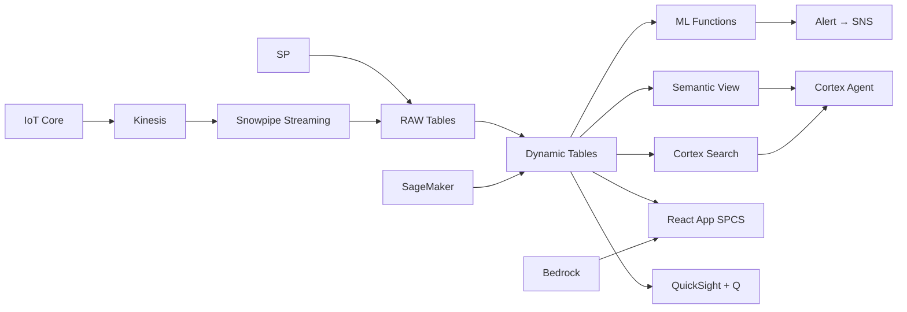

# Cold Chain Monitoring

Real-time cold chain monitoring across 800 trucks and 35 cold storage facilities — IoT Core tracks temperature excursions, ML.ANOMALY_DETECTION predicts equipment failure, and SNS alerts operations before product loss.

## Architecture

Thailand's food cold chain spans 800 refrigerated trucks and 35 storage facilities distributing seafood, poultry, and prepared meals nationwide. Temperature excursions cause ฿180M quarterly in product loss — but traditional monitoring only alerts after the damage is done. ML-powered prediction catches failures 5-7 days early.



## Snowflake Capabilities

| Capability | Implementation |
|-----------|---------------|
| Dynamic Tables | FLEET_COMPLIANCE_STATUS / EXCURSION_TIMESERIES / ROUTE_RISK_SCORES / PRODUCT_LOSS_SUMMARY |
| ML Functions | ML.FORECAST + ML.ANOMALY_DETECTION |
| Cortex AI | COMPLETE, AI_CLASSIFY, SUMMARIZE |
| Cortex Search | 3000 documents indexed |
| Cortex Agent | COLD_CHAIN_AGENT |
| Semantic View | COLD_CHAIN_ANALYTICS |
| React App (SPCS) | 5 tabs + DemoGuide |


## AWS Services

| Service | Role in Demo |
|---------|-------------|
| AWS IoT Core | Ingest temperature sensor data from 800 trucks and 35 facilities (2M readings) |
| Amazon Kinesis | Stream real-time temperature and GPS data |
| Amazon SageMaker | Predictive model for compressor failure and excursion risk |
| Amazon Bedrock (Claude) | Generate root-cause analysis reports for excursion events |
| Amazon SNS | Real-time alerts for temperature excursions and equipment failures |
| Amazon QuickSight + Q | Cold chain compliance dashboard with NL queries |


## Personas

| Persona | Role | Key Questions |
|---------|------|---------------|
| **Wichai Anantabutr** | VP Supply Chain & Logistics | "What's our cold chain compliance rate today?" "How much product loss from temperature excursions this month?" |
| **Jintana Srikumpa** | Cold Chain Operations Manager | "Which trucks currently have temperature excursions?" "Show me the temperature history for Truck-247 last delivery." |


## Data

| Table | Rows | Description |
|-------|------|-------------|
| VEHICLES | 800 | Refrigerated trucks with GPS and temperature IoT sensors |
| COLD_STORAGE | 35 | Cold storage warehouses and distribution centers |
| TEMPERATURE_READINGS | 2,000,000 | IoT temperature readings every 5 minutes (800 trucks × 35 facilities × 30 days) |
| EXCURSION_EVENTS | 1,200 | Temperature excursion events with duration and product impact |
| SHIPMENTS | 45,000 | Active and historical shipment records |
| EQUIPMENT_MAINTENANCE | 3,000 | Refrigeration equipment maintenance records |
| PRODUCT_LOSS | 800 | Product spoilage and rejection records from cold chain failures |
| THAI_FOOD_LOGISTICS | 8 | Thailand cold chain logistics industry context |


## Build Instructions

### Prerequisites
- Snowflake account with ACCOUNTADMIN access
- Cortex AI enabled (ML Functions, Search, Agent)
- Warehouse: COLDCHAIN_WH (Medium)
- AWS CLI with access (us-west-2)

### Deployment

```bash
snowsql -f snowflake/00_setup.sql
snowsql -f snowflake/01_marketplace_install.sql
snowsql -f snowflake/02_raw_tables.sql
snowsql -f snowflake/03_staging.sql
snowsql -f snowflake/04_dynamic_tables.sql
snowsql -f snowflake/05_search.sql
snowsql -f snowflake/06_ml_models.sql
snowsql -f snowflake/07_semantic_view.sql
snowsql -f snowflake/08_agent.sql
```

### React App (SPCS)
```bash
cd app && npm ci && npm run build
docker build -t aws-thailand-food-cold-chain-app .
docker push bdiqc8sm-default.registry.snowflakecomputing.com/cold_chain/app/aws_thailand_food_cold_chain/app:latest
```

### Demo Mode
Open the app URL with `?demo=true` for presenter view.

## Build Modes

### Snowflake Only
Run scripts 00-08 (skip AWS-specific integration). Uses:
- **Snowpipe Streaming SDK** instead of AWS IoT Core
- **Snowpipe Streaming SDK (direct)** instead of Amazon Kinesis
- **ML.ANOMALY_DETECTION + ML.FORECAST** instead of Amazon SageMaker
- **Cortex Complete** instead of Amazon Bedrock (Claude)
- **Alerts + Notification Integration** instead of Amazon SNS
- **Snowflake Intelligence (Cortex Analyst)** instead of Amazon QuickSight + Q

### Full AWS + Snowflake
Run all scripts including AWS integration. Deploy QuickSight dashboard from `quicksight/`.

## Business Impact

Industry research and Snowflake customer outcomes:
- **Thailand's cold chain logistics market valued at ฿85B (US$2.4B) growing 8% annually** — [Krungsri Research](https://www.krungsri.com/en/research)
- **Cold chain failures cause 30-40% of food loss in Southeast Asian supply chains** — [FAO](https://www.fao.org/food-loss-and-food-waste/en/)
- **Predictive cold chain monitoring reduces product loss by 25-40% through early intervention** — [McKinsey Supply Chain](https://www.mckinsey.com/capabilities/operations/our-insights)
- **CP Foods operates 1,000+ refrigerated trucks delivering to 130,000 points across Thailand** — [CP Foods](https://www.cpfworldwide.com/en)


## Key Demo Numbers

- **94.2%** cold chain compliance rate (47 trucks non-compliant)
- **฿180M** quarterly product loss from cold chain failures (US$5.1M)
- **12 failures** predicted in next 7 days (ML.ANOMALY_DETECTION)
- **2M readings** temperature data points ingested monthly (5-min resolution)
- **835 assets** monitored (800 trucks + 35 cold storage facilities)
- **5-7 days** advance warning for compressor failures


## License

Apache 2.0 — See [LICENSE](LICENSE) for details.

This is a personal demo project and is not an official Snowflake offering. It comes with no support or warranty.